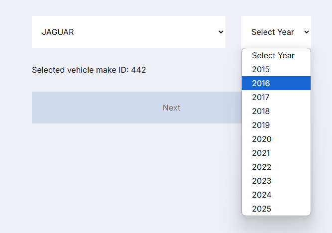
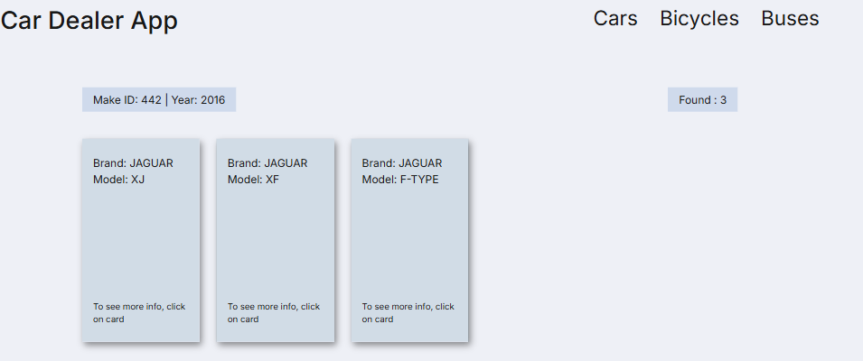

## Getting Started
First, you need install all dependencies. in console type [`npm i`] or [`npm install`]
Then, run the development server:

```bash
npm run dev
# or
yarn dev
# or
pnpm dev
# or
bun dev
```

Also you are able to start production server.
[`npm build`] then [`npm start`]

Open [http://localhost:3000](http://localhost:3000) with your browser to see the result.

## Learn More

As soon as you open the site, you will see "Home page". 
There is a form, which you have to fill and click "Next" button.


You will see the list of filtered cars.

